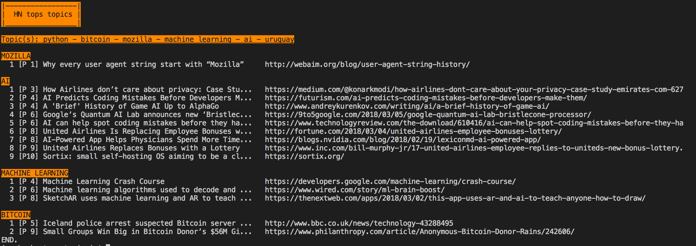

HN tops topics
==============
Command line tool for scrapping https://news.ycombinator.com and filtering by a group of keywords.

### Dependences
* request_html
* colorconsole

### Usage
```
$ python hn-tops-topic.py "python,bitcoin,mozilla,machine learning,ai,uruguay" --max-pages 10 --max-news 20
```

#### Parameters
- max-pages: maximum amount of pages to be scrapped
- max-news: maximum amount of news/links to be scrapped

### Example


☼ Feel free to use ☼